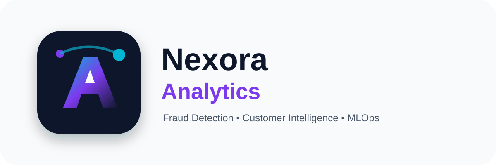

# Nexora Analytics  
### Fraud Detection • Customer Intelligence • MLOps



---

# Présentation du projet

**Nexora Analytics** est une solution intelligente de Data Science et MLOps combinant :

- détection de fraude bancaire,
- segmentation intelligente des clients,
- interprétabilité des modèles IA,
- industrialisation et déploiement MLOps.

Le projet a été conçu dans une logique proche d’un environnement professionnel afin de couvrir l’ensemble du cycle de vie Machine Learning :

✅ Exploration des données  
✅ Prétraitement  
✅ Modélisation supervisée  
✅ Clustering  
✅ SHAP & IA explicable  
✅ Dashboard interactif Streamlit  
✅ API FastAPI  
✅ Docker  
✅ Monitoring  
✅ CI/CD  

---

# Objectifs du projet

## Exercice 1 — Détection de fraude bancaire

Construire un système capable de détecter automatiquement les transactions frauduleuses à partir de données financières.

### Travaux réalisés

- Analyse exploratoire des données
- Prétraitement et équilibrage des classes
- Entraînement de plusieurs modèles :
  - Régression Logistique
  - Random Forest
  - XGBoost
  - LightGBM
  - Réseau de neurones
- Évaluation des performances
- Interprétabilité avec SHAP
- Analyse des faux positifs / faux négatifs

---

## Exercice 2 — Segmentation intelligente des clients

Identifier automatiquement différents profils clients afin d’améliorer :

- les campagnes marketing,
- la fidélisation,
- la personnalisation des offres.

### Travaux réalisés

- Analyse exploratoire des comportements clients
- Analyse des revenus
- Prétraitement et normalisation
- Réduction de dimension (PCA)
- Clustering :
  - K-Means
  - DBSCAN
  - Agglomerative Clustering
  - Gaussian Mixture Models
- Évaluation :
  - Silhouette Score
  - Elbow Method
  - Davies-Bouldin Score
- Interprétation métier des segments
- Recommandations business

---

# Partie MLOps

Une réflexion MLOps complète a été intégrée au projet.

## Pipeline de données

- ingestion,
- validation,
- nettoyage automatique.

## Versionning

- données,
- modèles,
- paramètres.

## Déploiement

- Streamlit Dashboard,
- FastAPI,
- Docker.

## Monitoring

- suivi des performances,
- dérive des données,
- stabilité des modèles et clusters.

## CI/CD

- GitHub,
- automatisation,
- déploiement continu.

---

# Architecture du projet

```text
Nexora-Analytics/
│
├── dashboard/
│   ├── app.py
│   └── assets/
│       └── nexora_logo.svg
│
├── deployment/
│   └── api/
│       └── main.py
│
├── notebooks/
│
├── reports/
│   └── rapport.html
│
├── requirements.txt
├── Dockerfile
├── render.yaml
└── README.md
```

---

# Technologies utilisées

## Data Science & IA

- Python
- Pandas
- NumPy
- Scikit-learn
- XGBoost
- LightGBM
- SHAP

## Visualisation

- Plotly
- Streamlit

## Déploiement & MLOps

- FastAPI
- Docker
- GitHub
- Render

---

# Dashboard interactif

Le projet inclut un dashboard Streamlit moderne permettant :

- l’analyse des performances des modèles,
- la visualisation des segments clients,
- l’exploration des métriques,
- une simulation de prédiction de segment,
- le téléchargement du rapport final HTML.

---

# Rapport interactif HTML

Le projet contient également un rapport interactif premium avec :

- visualisations dynamiques,
- interprétations métier,
- statistiques,
- architecture MLOps,
- recommandations business,
- conclusion générale.

---

# Lancer le projet localement

## 1. Cloner le projet

```bash
git clone https://github.com/VOTRE_USERNAME/Nexora_Analytics.git
```

---

## 2. Créer l’environnement virtuel

```bash
python -m venv .venv
```

---

## 3. Activer l’environnement

### Windows

```bash
.venv\Scripts\activate
```

### Linux / Mac

```bash
source .venv/bin/activate
```

---

## 4. Installer les dépendances

```bash
pip install -r requirements.txt
```

---

# Lancer le dashboard Streamlit

```bash
streamlit run dashboard/app.py
```

---

# Lancer l’API FastAPI

```bash
uvicorn deployment.api.main:app --reload
```

---

# Docker

## Construire l’image

```bash
docker build -t nexora-analytics .
```

## Lancer le conteneur

```bash
docker run -p 8501:8501 nexora-analytics
```

---

# Déploiement Render

Le projet est compatible avec Render grâce au fichier :

```text
render.yaml
```

Application disponible sur Render :

https://TON-LIEN-RENDER.onrender.com

---

# Résultats obtenus

## Détection de fraude

- modèles performants,
- bon F1-Score,
- bonne capacité de détection des fraudes,
- interprétabilité SHAP.

## Segmentation client

Identification de plusieurs profils :

- clients VIP,
- clients premium fidèles,
- clients digitaux,
- clients économes,
- clients occasionnels.

---

# Recommandations business

## Fidélisation

- programmes VIP,
- avantages personnalisés,
- récompenses ciblées.

## Marketing

- campagnes personnalisées,
- segmentation marketing avancée,
- recommandations produits.

## MLOps

- monitoring des performances,
- surveillance de dérive,
- industrialisation des modèles.

---

# Auteur

Ndeye Madeleine Diallo ISM-M2-CDSD

## Nexora Analytics

Projet Data Science & MLOps réalisé dans une logique professionnelle combinant :

- Intelligence Artificielle,
- Analyse des données,
- Machine Learning,
- Clustering,
- Déploiement,
- Industrialisation IA.

---

# Licence

Projet académique et pédagogique.